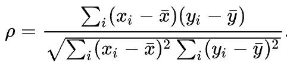

# 词汇相似度计算

语义计算与知识检索（22春）第一次作业

作者：Nascent

[github link](https://github.com/chnln/WordSimilarityComputation)

- [词汇相似度计算](#词汇相似度计算)
  - [1 任务描述](#1-任务描述)
  - [2 实验环境](#2-实验环境)
    - [2.1 工具](#21-工具)
    - [2.2 文件目录](#22-文件目录)
  - [3 实验内容](#3-实验内容)
    - [3.1 评价指标](#31-评价指标)
    - [3.2 基于词典的词语相似度计算](#32-基于词典的词语相似度计算)
      - [3.2.1 实验方法](#321-实验方法)
      - [3.2.2 实验结果](#322-实验结果)
    - [3.3 基于语料库的相似度计算](#33-基于语料库的相似度计算)
  - [4 想法](#4-想法)
  - [5 参考文献](#5-参考文献)

## 1 任务描述

1. 目标：实现2种词汇相关度计算方法，基于词典与基于语料各一种。
2. 数据：基于MTurk-773（Guy Halawi等，2014）进行实验和分析[^1]。
   - Mturk-773是一个在Wordnet（ George A. Miller，1995；Christiane Fellbaum，1998）基础上提出的，由人类打分生成的，用来测试词语相关性算法（word relatedness algorithm）的数据集。
   - 制作者主要考虑Wordnet中的名词对（noun pairs），按1到4的图距离（graph distance）均匀地从中抽取名词对，并借助雅虎搜索引擎排除了其中的罕见词。
   - 人类打分通过亚马逊众包平台AMT（Amazon's Mechanical Turk）进行。每个词对进行了平均20次打分，最终的相关性分数为这些打分的均值。打分范围为1至5，其中5代表非常相关（highly related），1代表不相关（not related）。
3. 评价指标：开放式。

[^1]: 本文使用的下载地址为：https://github.com/vecto-ai/word-benchmarks


## 2 实验环境

### 2.1 工具

本实验在以下环境进行：

|工具|版本|
|:---:|:---:|
|python|3.7.12|
|nltk|3.7|
|wordnet|3.0|
|gensim|4.1.2|
|numpy|1.21.5|
|pandas|1.3.4|
|tqdm|4.62.3|


|pytorch|1.10.2|
|transformers|4.16.2|

### 2.2 文件目录

```
.
├── data
│   └── mturk-771.csv // 数据集
├── README.md
├── result
│   ├── w2v_mturk771.csv // word2vec实验结果
│   ├── w2v_spearman.csv // word2vec和数据集的相关系数
│   ├── wordnet_mturk771.csv // wordnet实验结果
│   └── wordnet_spearman.csv // wordnet和数据集的相关系数
├── w2v_word_similarity.ipynb // word2vec实验过程
└── wordnet_word_similarity.ipynb // wordnet实验过程
```

## 3 实验内容

### 3.1 评价指标 

考虑到MTurk-771数据集的样本来源，以及相关性打分的非连续性，这里选用Spearman相关系数（下图）来评价相似度计算方法，通过比较不同方法得到的词语相似度和数据集人类打分情况的Spearman相关系数值，来判断不同方法的优劣。



### 3.2 基于词典的词语相似度计算

#### 3.2.1 实验方法

本小节利用Wordnet和NLTK工具[^2]进行基于词典的词语相似度计算。NLTK基于Wordnet建立的词义（word sense）节点图，提供了六种词语相似度计算方法，如下：

[^2]: NLTK官网：https://www.nltk.org/

|方法|描述|
|:---:|:---|
|path_similarity()|基于两个词义节点之间的最短路径|
|lch_similarity()|基于两个词义节点之间的最短路径和分类法上的最大深度（maximum depth of the taxonomy）|
|wup_similarity()|基于两个词义节点分类法上的深度和最小公共包容节点（least common subsumer，简称LCS），也即最深的共同祖先节点（most specefic ancestor node）|
|res_similarity|基于LCS的信息内容|
|jcn_similarity|基于LCS的信息内容和输入的两个同义词集（input Synsets）的情况|
|lin_similarity|基于LCS的信息内容和输入的两个同义词集的情况|

其中后三种分法需要用到Wordnet中词语的信息内容（information content，简称IC），NLTK提供不同语料上训练得到的IC，本实验使用了Brown和Semcor两个语料库的IC。

由于Wordnet将同一词形的不同词性、不同词义聚合在一起，对于从数据集输入的两个词word1和word2，Wordnet返回的会是两个同义词集Synsets，假设里面的具体词义分别有m和n个，会得到m*n对需要考察的词义对。为了解决这个问题，考虑到MTurk-771在制作时只抽取了名词对，首先将非名词词义排除掉；接下来，对于word1和word2所有名词词义对的相似度值，考虑取其中的最大值和平均值这两种方法，通过实验比较效果。

#### 3.2.2 实验结果

实验变量有：IC来源，对两个Synsets输出所有词义对的最大值或平均值（记为`method_cal = max/ave`），和六种相似度计算方法。

对于IC，控制输出两个Synsets所有词义对的最大值，结果如下，表格中的数值为对应行、列条件下得到的相似度与数据集的Spearman相关系数值：

||res|jcn|lin|
|:---:|:---:|:---:|:---:|
|brown|0.404394|0.477480|0.487702|
|semcor|0.346535|**0.485960**|**0.495680**|

可以看出，Semcor语料库的IC表现略好，但在`res_similarity()`方法上表现很差。考虑到`jcn_similarity()`和`lin_similarity()`利用了输入的Synsets，且Semcor语料库本身即是在Wordnet上构建出来的，可能是Semcor语料库的IC更好地学习到了Wordnet的知识。Brown语料库的IC表现则比较稳定。

对于`method_cal`，控制IC为Brown数据库上的IC，结果如下，表格中数值的含义如上：

||path|lch|wup|res|jcn|lin|
|:---:|:---:|:---:|:---:|:---:|:---:|:---:|
|max|**0.490132**|**0.490132**|**0.450494**|**0.404394**|0.477480|**0.487702**|
|ave|0.392636|0.289612|0.254518|0.343811|**0.489340**|0.370809|

可以看到，除了`jcn_similarity()`方法，对两个Synsets输出所有词义对的最大值的方法显著优于输出平均值的方法。这说明对于输出的两个Synsets，所有词义对中相似度最大的一对更贴近数据集希望比较的词义。

对于六种相似度计算方法，结果如下，表格中数值含义同上：

||path|lch|wup|res|jcn|lin|
|:---:|:---:|:---:|:---:|:---:|:---:|:---:|
|max_brown|**0.490132**|**0.490132**|0.450494|0.404394|0.477480|0.487702|
|ave_brown|0.392636|0.289612|0.254518|0.343811|**0.489340**|0.370809|
|max_semcor|**0.490132**|**0.490132**|0.450494|0.346535|0.485960|0.495680|
|ave_semcor|0.392636|0.289612|0.254518|0.333146|0.434607|**0.399058**|

可以看出，`path_similarity()`、`lch_similarity()`和`jch_similarity()`三种方法总体表现较好；`wup_similarity()`方法表现较差；但总体来说，基于Wordnet计算词语相似度的这六种方法效果都不好，表现最好的情况与数据集的相关系数也只有不到0.5。

### 3.3 基于语料库的相似度计算

本小节利用word2vec算法和gensim库进行基于语料库的相似度计算，使用了谷歌发布的在新闻语料上训练完毕的、300维的模型`GoogleNews-vectors-negative300.bin.gz`[^3]

[^3]: 下载地址：https://code.google.com/archive/p/word2vec/

实验结果为：

||similarity|w2v|
|:---:|:---:|:---:|
|similarity|1.00000|0.67131|
|w2v|0.67131|1.00000|

与上一小节比较发现，使用word2vec算法进行的词语相似度计算效果显著优于利用Wordnet进行的计算，原因可能在于:

1. MTurk-771数据集在制作时，要求标注者对词对的相关性进行打分，因此其本身并不是一项面向词语相似度计算的任务。比如“水果”和“水果店”是相关的，但两者并不是相似的。基于Wordnet的方法本质上利用的是Wordnet所建立的词义图里节点的关系，和Wordnet关注的Synonym息息相关，更贴近于对“同义”、“近义”性的计算；而word2vec建立在大规模语料中词语的分布情况上，其定义的“similarity”更贴近于相关性，比如使用gensim的`most_similar()`方法计算“student”最相似的词，前10个词中包含“teacher”、“university”、“semester”等词，这些词从词义上看和“student”是高度相关的，但称不上同义、近义。
2. 从训练规模的角度看，基于word2vec的方法所使用的语料资源更多，可能学习到了更多的词语间的交互信息，在表示和计算词义时占有优势。

## 4 想法

以上实验之外，对于使用BERT计算动态词向量，用以词汇相似度计算本人也有尝试，不过可能由于环境配置、算力限制和技术能力原因，效果很差，这里就没展示。具体思路为：将大规模语料输入到BERT模型，通过取出最后一层隐藏层/合并最后n层隐藏层得到每个token的向量表示，再对语料中的每个type取所有token的平均值作为该词的动态词向量表示，使用余弦值计算相似度。

## 5 参考文献

1. Guy Halawi, Gideon Dror, Evgeniy Gabrilovich, and Yehuda Koren. Large-scale learning of word relatedness with constraints. KDD ’12, page 1406–1414, New York, NY, USA. Association for Computing Machinery. 2012.
2. George A. Miller. WordNet: A Lexical Database for English. Communications of the ACM Vol. 38, No. 11: 39-41. 1995.
3. Christiane Fellbaum. WordNet: An Electronic Lexical Database. Cambridge, MA: MIT Press. 1998.
4. NLTK Document on Wordnet. https://www.nltk.org/howto/wordnet.html.