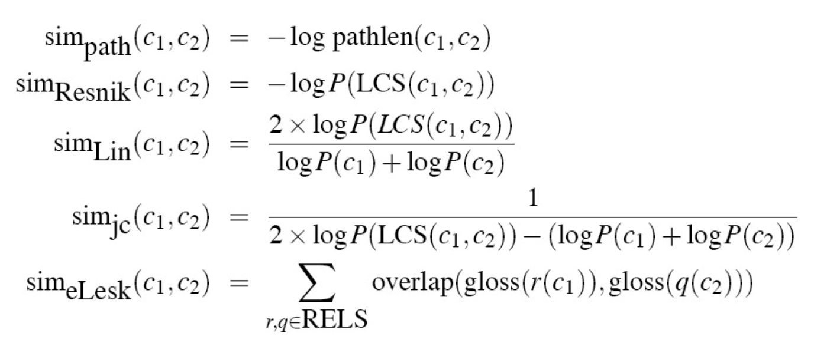

# 词汇相似度计算

语义计算与知识检索（22春）第一次作业

作者：Nascent

- [词汇相似度计算](#词汇相似度计算)
  - [1 任务描述](#1-任务描述)
  - [2 实验环境](#2-实验环境)
  - [3 实验内容](#3-实验内容)
    - [3.1 评价指标](#31-评价指标)
    - [3.2 基于词典的词语相似度计算](#32-基于词典的词语相似度计算)
    - [3.3 基于语料库的相似度计算](#33-基于语料库的相似度计算)
    - [3.4 补充：动态词向量的表现](#34-补充动态词向量的表现)
  - [4 实验分析](#4-实验分析)
  - [5 参考文献](#5-参考文献)

## 1 任务描述

1. 目标：实现2种词汇相关度计算方法，基于词典与基于语料各一种。
2. 数据：基于MTurk-773（Guy Halawi等，2014）进行实验和分析[^1]。
   - Mturk-773是一个在Wordnet（ George A. Miller，1995；Christiane Fellbaum，1998）基础上提出的，由人类打分生成的，用来测试词语相关性算法（word relatedness algorithm）的数据集。
   - 制作者主要考虑Wordnet中的名词对（noun pairs），按1到4的图距离（graph distance）均匀地从中抽取名词对，并借助雅虎搜索引擎排除了其中的罕见词。
   - 人类打分通过亚马逊众包平台AMT（Amazon's Mechanical Turk）进行。每个词对进行了平均20次打分，最终的相关性分数为这些打分的均值。打分范围为1至5，其中5代表非常相关（highly related），1代表不相关（not related）。
3. 评价指标：开放式。

[^1]: 本文使用的下载地址为：https://github.com/vecto-ai/word-benchmarks

## 2 实验环境

本实验在以下环境进行：

|工具|版本|
|:---:|:---:|
|python|3.7.12|
|nltk|3.7|
|wordnet|3.0|
|gensim|4.1.2|
|pytorch|1.10.2|
|transformers|4.16.2|

## 3 实验内容

### 3.1 评价指标 

### 3.2 基于词典的词语相似度计算

变量：ic，max/ave，距离函数

wordnet

wordnet中，名词之间的关系主要有
- 同义关系（synonym relation）
- 部分-整体关系（meronymy relation），比如leg和table
- 上下位关系（holonymy relation），比如桌子和家具

对ic的选择，控制变量，三个不同的ic

对max还是ave的选择

实验结果

### 3.3 基于语料库的相似度计算

gensim，相似度

google-news-300[^2]

[^2]: 下载地址：https://code.google.com/archive/p/word2vec/

### 3.4 补充：动态词向量的表现

## 4 实验分析

## 5 参考文献

1. Guy Halawi, Gideon Dror, Evgeniy Gabrilovich, and Yehuda Koren. Large-scale learning of word relatedness with constraints. KDD ’12, page 1406–1414, New York, NY, USA. Association for Computing Machinery. 2012.
2. George A. Miller. WordNet: A Lexical Database for English. Communications of the ACM Vol. 38, No. 11: 39-41. 1995.
3. Christiane Fellbaum. WordNet: An Electronic Lexical Database. Cambridge, MA: MIT Press. 1998.